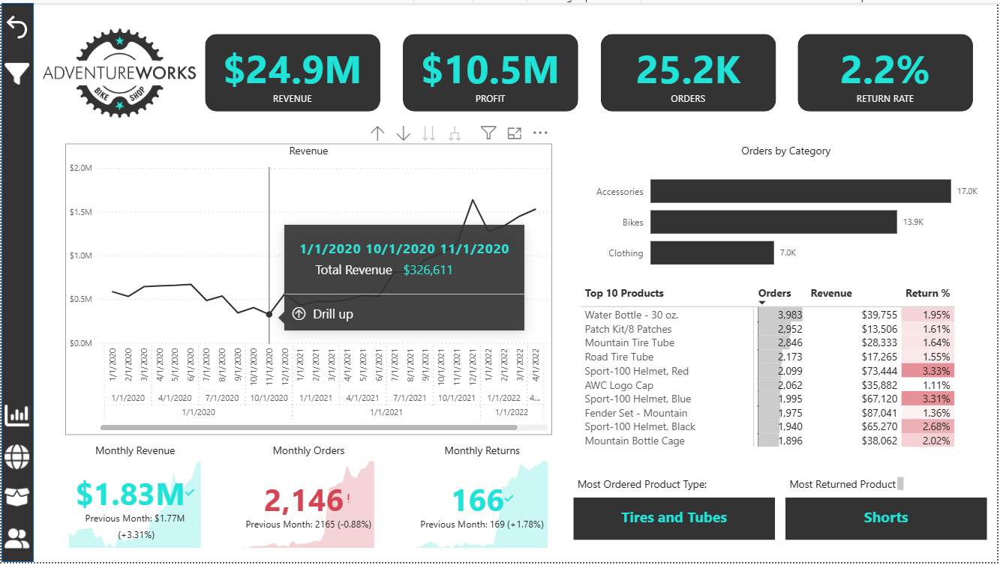
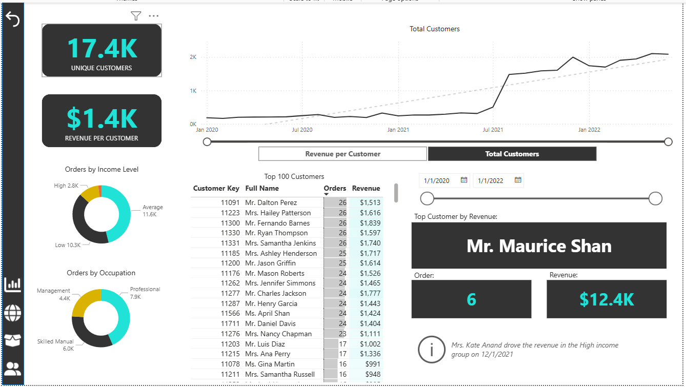
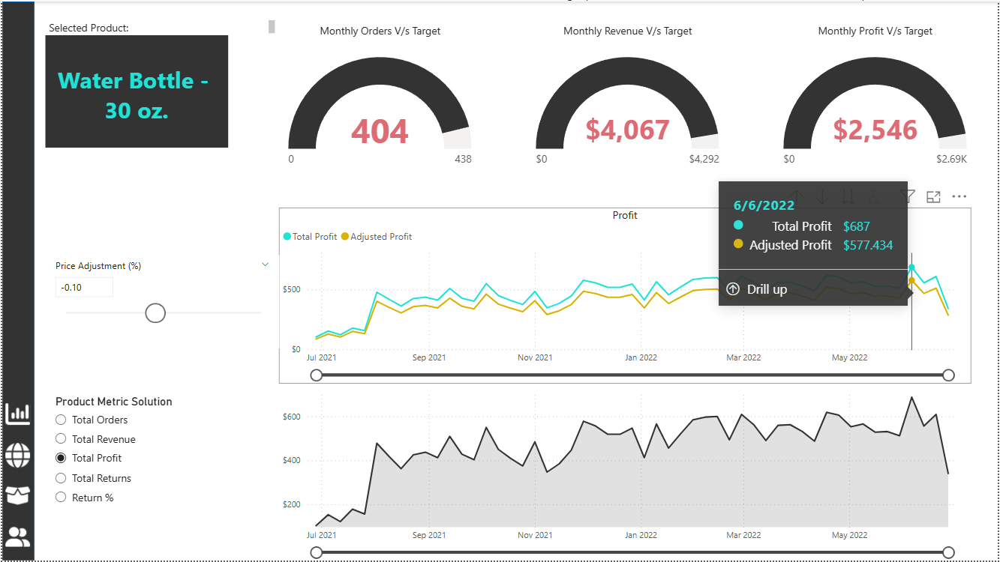
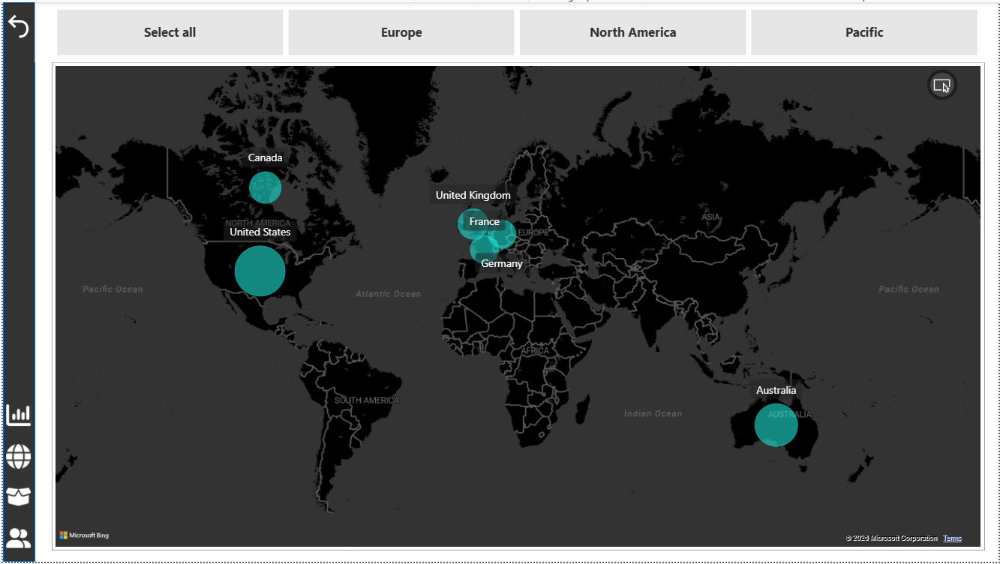
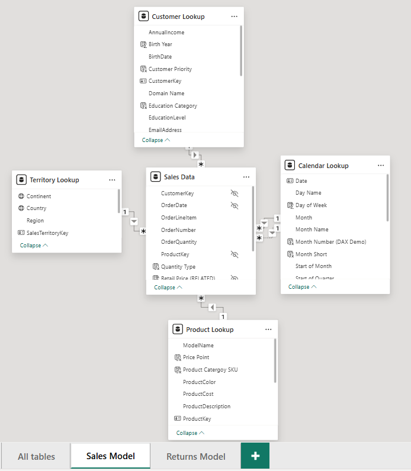
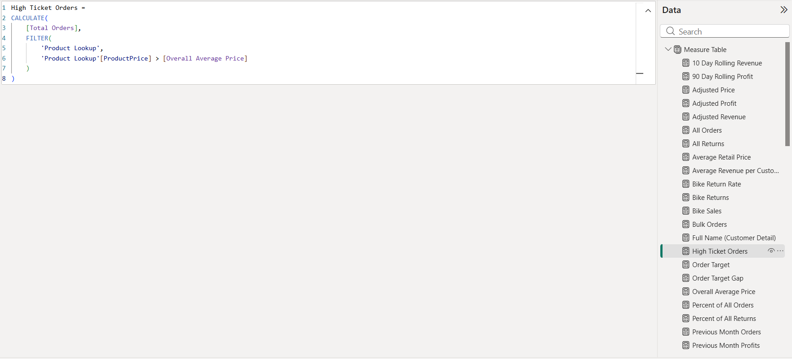

# Power BI Portfolio | Charul Kumawat

Hi, I am Charul, a market reserach analyst with an enthusiasm in data and research-driven decision making to drive organization gorwth. This portfolio highlights my skills as a business analyst.

# 📊 AdventureWorks Sales Performance Dashboard

A multi-page Power BI dashboard designed to analyze **sales performance, customer behavior, product trends, and regional distribution** to support data-driven business decisions.

---

## 🎯 Business Objective

To identify key drivers of:

* Revenue and profit growth
* Customer purchasing behavior
* Product performance and return trends
* Regional sales distribution

The goal is to enable stakeholders to make **strategic decisions around sales optimization, customer targeting, and product strategy**.

---

## 🧩 Dashboard Overview

### 🔹 Executive Summary

* Revenue: **$24.9M**
* Profit: **$10.5M**
* Orders: **25.2K**
* Return Rate: **2.2%**

Tracks overall business performance and trends over time, enabling quick executive-level decision making.

---

### 👥 Customer Analysis

* Total Customers: **17.4K**
* Revenue per Customer: **$1.4K**

Key capabilities:

* Identify **top 100 customers by revenue**
* Analyze **orders by income level and occupation**
* Track **customer growth trends over time**

👉 **Insight:** Revenue is concentrated among a subset of high-value customers, indicating opportunities for targeted retention and upselling strategies.

---

### 📦 Product Performance Analysis

* Tracks **top-performing products by revenue and orders**
* Monitors **return percentage per product**
* Compares **monthly targets vs actual performance**

Key feature:

* Dynamic **price adjustment simulation** to evaluate impact on profit

👉 **Insight:** Certain products generate high revenue but also show elevated return rates, indicating potential quality or expectation gaps.

---

### 🌍 Regional Analysis

* Sales distribution across:

  * North America
  * Europe
  * Pacific

Interactive map enables:

* Geographic performance comparison
* Identification of high-performing regions

👉 **Insight:** Revenue contribution is uneven across regions, highlighting opportunities for expansion in underperforming markets.

---

### 📈 Trend Analysis

* Monthly revenue, profit, and order tracking
* Rolling metrics using DAX
* Target vs actual comparisons

👉 **Insight:** Business shows consistent growth trends with periodic fluctuations, useful for forecasting and planning.

---

## 🏗️ Data Model

* Star schema structure with:

  * Fact Table: **Sales Data**
  * Dimension Tables:

    * Customer Lookup
    * Product Lookup
    * Territory Lookup
    * Calendar Lookup

👉 Ensures efficient filtering, aggregation, and scalability.

---

## 🧠 DAX & Analytical Techniques

Implemented advanced DAX measures such as:

* Rolling revenue and profit metrics
* Target vs actual comparisons
* High-ticket order identification
* Adjusted profit calculations

Example:

```DAX
High Ticket Orders =
CALCULATE(
    [Total Orders],
    FILTER(
        'Product Lookup',
        'Product Lookup'[ProductPrice] > [Overall Average Price]
    )
)
```

---

## 🛠️ Tools & Technologies

* Power BI (Data Visualization & Dashboarding)
* DAX (Advanced Calculations)
* Data Modeling (Star Schema Design)

---

## 📸 Dashboard Preview

### Executive Dashboard



### Customer Analysis



### Product Analysis



### Regional Analysis



### Data Model



### DAX Measures



---

## 🚀 Key Business Impact

* Enabled **data-driven decision making** through centralized dashboards
* Identified **high-value customers and revenue concentration**
* Highlighted **product-level performance and return risks**
* Provided **regional insights for expansion strategies**
* Improved visibility into **sales trends and performance tracking**

---

## 📬 Contact

* LinkedIn: https://www.linkedin.com/in/charul-kumawat-03526b239/
* Email: [charulk97@gmail.com](mailto:charulk97@gmail.com)

